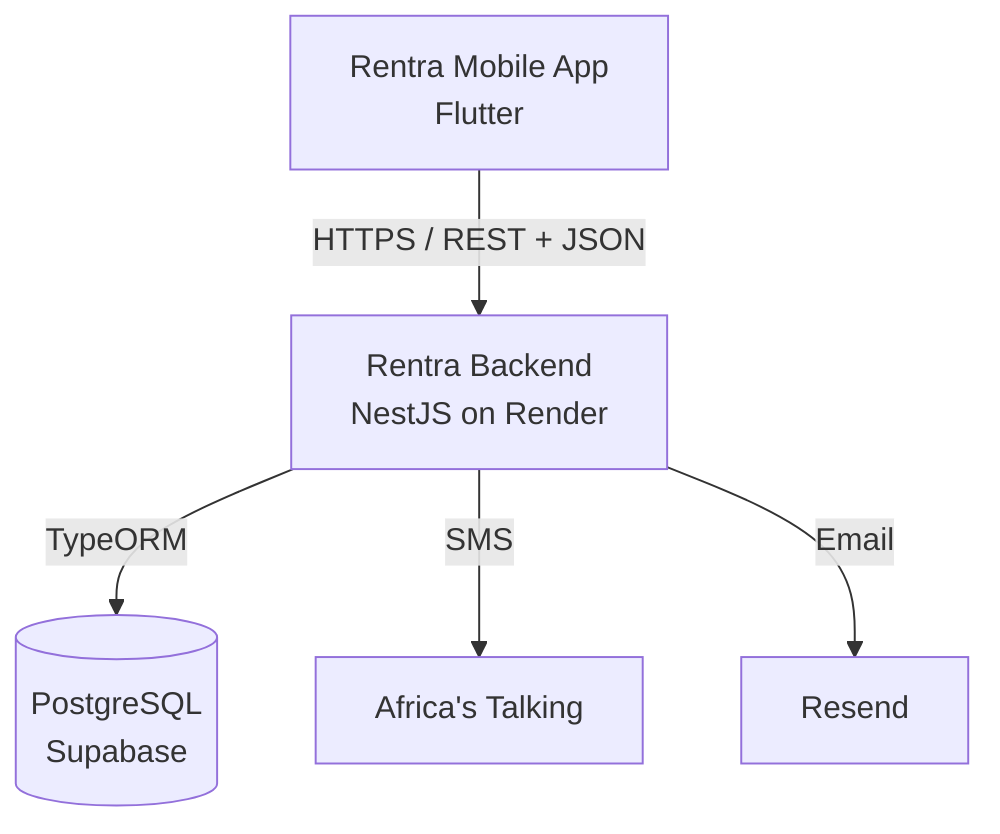
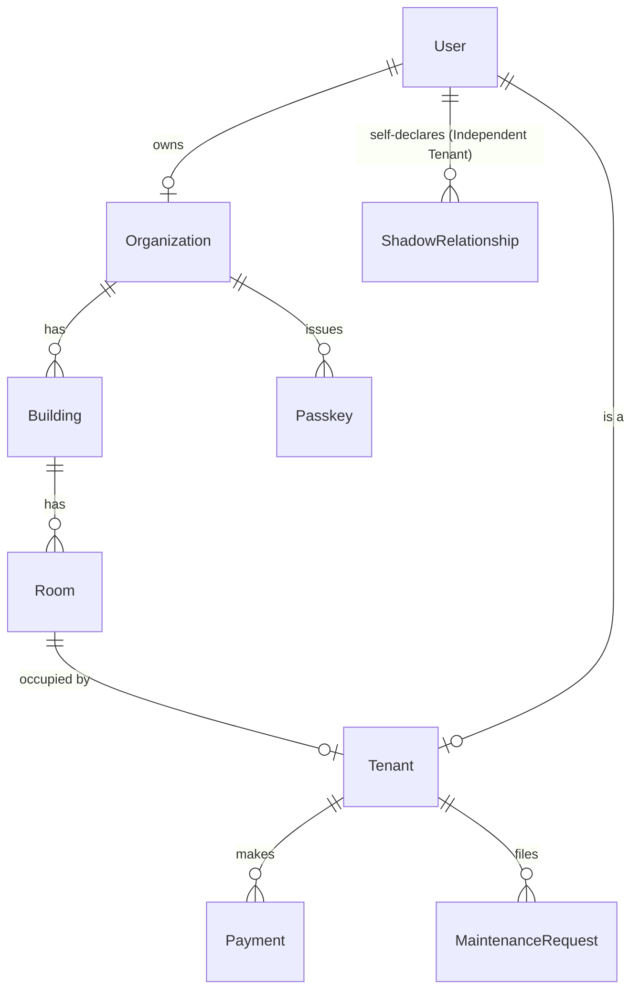
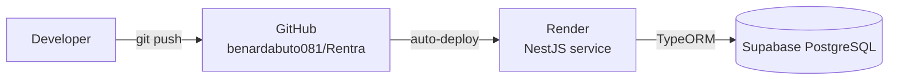

# Rentra — Housing Operating System for Africa


Rentra is a **Housing Operating System** for the African rental market — a single platform that digitizes the relationship between **tenants**, **landlords**, and **caretakers** across the full lifecycle of a tenancy: onboarding, occupancy, payments, maintenance, and move-out.

This README is the technical entry point to the repository. It describes the system **as it currently exists in code**, not as an idealized target architecture. Where implementation lags behind the product vision, that gap is stated explicitly rather than glossed over.

---

## Table of Contents

1. [Product Overview](#product-overview)
2. [Product Philosophy](#product-philosophy)
3. [System Architecture](#system-architecture)
4. [Repository Structure](#repository-structure)
5. [Backend Architecture](#backend-architecture)
6. [Mobile Architecture](#mobile-architecture)
7. [Domain Model](#domain-model)
8. [Authentication &amp; Authorization](#authentication--authorization)
9. [API Architecture](#api-architecture)
10. [Configuration &amp; Environment](#configuration--environment)
11. [Local Development](#local-development)
12. [Testing](#testing)
13. [Deployment](#deployment)
14. [Current Implementation Status](#current-implementation-status)
15. [Product Architecture vs. Implementation](#product-architecture-vs-implementation)
16. [Engineering Principles](#engineering-principles)
17. [Contribution Guide](#contribution-guide)
18. [Development Workflow](#development-workflow)
19. [Design System](#design-system)
20. [Error Handling &amp; Reliability](#error-handling--reliability)
21. [Data &amp; Financial Integrity](#data--financial-integrity)
22. [Security](#security)
23. [Known Limitations](#known-limitations)
24. [Roadmap](#roadmap)
25. [Documentation Map](#documentation-map)

---

## Product Overview

Rentra is not a listings site, not a rent-collection app, and not a generic property management tool. It is the operating system that sits underneath everyday rental life — the place where a tenancy is set up, tracked, paid for, and maintained.

**Three user roles, and only three:**

- **Tenant** — a person renting a space. Tenants are further split into two types that matter architecturally:
  - **Managed Tenant** — their landlord is on Rentra. Their tenancy, rent, and unit are linked to a real `Organization`/`Building`/`Room` record.
  - **Independent Tenant** — their landlord is *not* on Rentra. They self-declare their rental (via a `ShadowRelationship`, see [Domain Model](#domain-model)) so they can still build a rental history and manage their own records, with the intent that this can later link to a real landlord relationship if one joins Rentra.
- **Landlord** — owns or manages one or more properties (an `Organization` in the backend's internal model).
- **Caretaker** — delegated by a landlord to help run day-to-day operations, with narrower permissions than a landlord.

**Product pillars:** Housing Management, Tenant Experience, Trust, Simplicity, Continuity.

---

## Product Philosophy

Rentra's guiding idea is stated in its foundational product documents as: **"Rentra is a companion, not software."** In engineering terms, this translates into a handful of concrete implementation habits worth internalizing before you touch the code:

- **Clarity over cleverness** — prefer the obvious implementation over the elegant one, especially in anything user-facing.
- **One primary action per screen** — avoid overloading a single view with competing responsibilities.
- **Invisible complexity** — internal concepts (`Organization`, `Room`, multi-tenancy) should never leak into user-facing language. The product speaks of "Property Portfolio" and "Unit"; the backend calls them `Organization` and `Room` — see the naming note in [Backend Architecture](#backend-architecture).
- **Human language, not technical language** — API error messages and UI copy should read like a person wrote them, not a stack trace.
- **Reduce typing, never ask twice** — favor selection over free text, and don't re-request information the system already has.
- **Trust, calmness, confidence, progress, continuity** — the five feelings every interaction should produce. Concretely: every state-changing action needs clear, immediate feedback, and nothing should leave a user wondering whether something worked.

These principles govern UX and product decisions more than backend internals, but they inform naming, error messages, and API response shapes throughout.

---

## System Architecture



This reflects the **actual current system**, verified against source:

- The Flutter app communicates with the backend over plain HTTPS/JSON, using hardcoded absolute URLs to the production API (see `mobile/lib/constants/api_constants.dart`) — there is currently no environment-based switching between local and production API targets baked into the app itself.
- The backend is a single NestJS service, deployed on **Render**, connecting to a **Supabase-hosted PostgreSQL** database via TypeORM.
- OTP delivery is split across two providers: **Africa's Talking** for SMS, **Resend** for email.
- There is no API gateway, no message queue, no caching layer, and no separate microservices — this is a single monolithic NestJS application.

**Boundary responsibilities:**

| Layer                 | Responsibility                                                                      |
| --------------------- | ----------------------------------------------------------------------------------- |
| Flutter client        | Rendering, local session storage (`shared_preferences`), calling the API directly |
| NestJS backend        | Authentication, authorization, business logic, validation (partial), persistence    |
| PostgreSQL (Supabase) | System of record for all domain data                                                |

**Authentication boundary:** the backend issues a signed JWT on login; the client stores it and sends it as a `Bearer` token on every subsequent request. **Authorization boundary:** enforced backend-side via `JwtAuthGuard` (identity) and `RolesGuard` (role), described in full in [Authentication &amp; Authorization](#authentication--authorization).

---

## Repository Structure

```text
Rentra/
├── backend/                   # NestJS backend — the real, active backend
│   ├── src/
│   │   ├── auth/               # JWT auth, passkeys, RolesGuard, roles decorator
│   │   ├── users/               # Single User entity, role enum (landlord/caretaker/tenant)
│   │   ├── organizations/       # "Organization" = internal name for a landlord's property portfolio
│   │   ├── buildings/
│   │   ├── rooms/               # "Room" = internal name for a rentable Unit
│   │   ├── tenants/             # Tenancy records (links a User to a Room)
│   │   ├── payments/
│   │   ├── maintenance/
│   │   ├── dashboard/
│   │   ├── shadow-relationships/ # Independent Tenant self-declared rentals
│   │   ├── otp/                 # SMS/email OTP via Africa's Talking + Resend
│   │   ├── app.module.ts
│   │   └── main.ts
│   ├── .env.example
│   ├── package.json
│   └── README.md               # Default NestJS scaffold README (not yet customized)
│
├── mobile/                     # The real, active Flutter application
│   ├── lib/
│   │   ├── screens/             # 17 screens — see Mobile Architecture
│   │   ├── models/               # building, organization, payment, room, tenant, user
│   │   ├── services/             # auth_service.dart implemented; 4 others are empty stubs
│   │   ├── constants/            # api_constants.dart, app_colors.dart
│   │   └── main.dart
│   └── pubspec.yaml
│
├── lib/                        # Legacy — see note below
├── pubspec.yaml                 # Legacy — see note below
├── .gitignore
├── .metadata
└── README.md                    # This file
```

### `lib/` and root `pubspec.yaml` — legacy, non-functional scaffolding

The root-level `lib/main.dart` and `pubspec.yaml` are leftovers from an early `flutter create .` run directly at the repository root, before the real application was organized under `mobile/`. This was confirmed, not assumed: `lib/main.dart` at the root imports `constants/app_colors.dart` and `screens/splash_screen.dart` as relative paths — but no `constants/` or `screens/` directory exists under the root `lib/` at all. **This file will not compile as-is.** It is dead code. The active, maintained Flutter application is exclusively under `mobile/`. These root files are safe to remove in a future cleanup pass; that has not been done yet so as not to make unrelated changes outside the scope of any single task.

---

## Backend Architecture

**Stack:** NestJS 11, TypeORM 0.3, PostgreSQL (via `pg`), Passport + `@nestjs/jwt` for authentication, `bcrypt` for password hashing, `class-validator`/`class-transformer` present as dependencies (not yet globally wired — see [Known Limitations](#known-limitations)).

### Modules

| Module                   | Responsibility                                                                                                                                                                                                                                                                                                                                                                                  |
| ------------------------ | ----------------------------------------------------------------------------------------------------------------------------------------------------------------------------------------------------------------------------------------------------------------------------------------------------------------------------------------------------------------------------------------------- |
| `auth`                 | Registration (landlord, independent tenant), login (email for landlord/caretaker, phone for tenant), passkey generation and redemption, OTP orchestration                                                                                                                                                                                                                                       |
| `users`                | Single`User` entity shared by all three roles, distinguished by a `role` enum                                                                                                                                                                                                                                                                                                               |
| `organizations`        | A landlord's property portfolio (internal name:`Organization`)                                                                                                                                                                                                                                                                                                                                |
| `buildings`            | Buildings within an organization                                                                                                                                                                                                                                                                                                                                                                |
| `rooms`                | Rentable units within a building.**Naming note:** the product/UX documents call this concept "Unit" throughout; the backend module and most fields are named `Room`/`RoomsModule`, though the `Passkey` entity uses a field called `unitId`. This is an internal inconsistency worth normalizing, not a product-facing issue (users never see the word "Room" or "Organization"). |
| `tenants`              | A tenancy record — links a`User` to a `Room`, with rent/deposit/storage terms and move-in/notice/move-out state                                                                                                                                                                                                                                                                            |
| `payments`             | Rent, deposit, and storage payment records, tied to a Managed Tenant                                                                                                                                                                                                                                                                                                                            |
| `maintenance`          | Maintenance/issue tracking                                                                                                                                                                                                                                                                                                                                                                      |
| `dashboard`            | Aggregated overview/financial/building summaries for landlords and caretakers                                                                                                                                                                                                                                                                                                                   |
| `shadow-relationships` | Independent Tenants' self-declared rental relationships — see[Domain Model](#domain-model)                                                                                                                                                                                                                                                                                                      |
| `otp`                  | OTP generation, delivery (SMS via Africa's Talking, email via Resend), verification, expiry, and attempt-limiting                                                                                                                                                                                                                                                                               |

### Guards & Authorization

Two guards compose to protect routes: `JwtAuthGuard` (verifies the request carries a valid, unexpired JWT and attaches `{ userId, role }` to `req.user`) and `RolesGuard` (reads an `@Roles(...)` decorator and compares it against `req.user.role`, throwing `403 Forbidden` on mismatch). See [Authentication &amp; Authorization](#authentication--authorization) for the full role matrix and current protection status per controller.

### Validation, error handling, and hardening — current state

- No global `ValidationPipe` is registered. `class-validator`/`class-transformer` are installed as dependencies but DTOs largely rely on TypeScript interface shapes in controller method signatures rather than decorated, runtime-validated DTO classes.
- No Swagger/OpenAPI documentation is generated.
- No rate limiting (`@nestjs/throttler` or equivalent) is configured anywhere, including on OTP send, which is a real abuse vector (see [Known Limitations](#known-limitations)).
- No `Helmet` or equivalent security-header middleware.
- CORS is enabled with no origin restriction (`app.enableCors()`, no options).
- `ClassSerializerInterceptor` is registered globally, and the `User` entity's `password` field is marked `@Exclude()` — password hashes are correctly stripped from every serialized response.

---

## Mobile Architecture

**Stack:** Flutter/Dart, `http` for networking, `shared_preferences` for local session persistence, `intl` for formatting. **No state management library** (no Provider, Riverpod, Bloc, or GetX) — state is managed via `StatefulWidget` + `setState`, with session/auth state held in static fields on `AuthService`.

### Entry point

`mobile/lib/main.dart` — configures `MaterialApp`, a `ThemeData` (button/card/input styling), and launches into `SplashScreen`. Navigation elsewhere in the app is done via `Navigator.push(MaterialPageRoute(...))` per screen; there is no named-route table and no routing package (e.g. `go_router`).

### Screens (17, all under `mobile/lib/screens/`)

| Screen                                                     | Purpose                                                                                                                                                                                                                                               |
| ---------------------------------------------------------- | ----------------------------------------------------------------------------------------------------------------------------------------------------------------------------------------------------------------------------------------------------- |
| `splash_screen.dart`                                     | App launch                                                                                                                                                                                                                                            |
| `welcome_screen.dart`                                    | Entry/marketing screen                                                                                                                                                                                                                                |
| `create_account_screen.dart`                             | Registration                                                                                                                                                                                                                                          |
| `verify_email_screen.dart`, `verify_phone_screen.dart` | OTP verification                                                                                                                                                                                                                                      |
| `privacy_consent_screen.dart`                            | Consent step                                                                                                                                                                                                                                          |
| `role_selection_screen.dart`                             | Choosing Tenant / Landlord role                                                                                                                                                                                                                       |
| `owner_setup_screen.dart`                                | Landlord's initial setup                                                                                                                                                                                                                              |
| `tenant_setup_screen.dart`                               | Tenant's initial setup (largest screen file in the app)                                                                                                                                                                                               |
| `app_tour_screen.dart`                                   | Onboarding walkthrough                                                                                                                                                                                                                                |
| `login_screen.dart`                                      | Login                                                                                                                                                                                                                                                 |
| `main_shell_screen.dart`                                 | Bottom-navigation shell                                                                                                                                                                                                                               |
| `home_screen.dart`                                       | Tenant home tab                                                                                                                                                                                                                                       |
| `payments_screen.dart`                                   | Tenant payments tab — calls the API directly (see below)                                                                                                                                                                                             |
| `household_screen.dart`                                  | **UI placeholder only** — static "No household yet" empty state with non-functional buttons (`onPressed: () {}`). Matches the product roadmap's Household feature, which is explicitly a future phase, not yet backed by any implementation. |
| `activity_screen.dart`                                   | Tenant activity tab                                                                                                                                                                                                                                   |
| `account_screen.dart`                                    | Account/settings tab                                                                                                                                                                                                                                  |

`main_shell_screen.dart` implements a five-tab bottom navigation — **Home, Payments, Household, Activity, Account** — which matches the product's Information Architecture specification for tenant navigation exactly. The tenant onboarding and daily-use flow is the most developed part of the mobile app; dedicated landlord/caretaker navigation shells beyond initial setup were not found in the current screen set.

### Services and data layer — a real gap

`mobile/lib/services/` contains five files. **Four are empty (0 bytes):** `building_service.dart`, `payment_service.dart`, `room_service.dart`, `tenant_service.dart`. Only `auth_service.dart` is implemented. Confirmed directly in source: `payments_screen.dart` makes raw `http.get()` calls and does its own JSON parsing inline, rather than going through any service abstraction. There is currently no consistent API-client or repository layer — each screen that needs data reinvents its own HTTP handling.

### API target

`mobile/lib/constants/api_constants.dart` hardcodes the base URL to the production backend (`https://rentra-backend-z36t.onrender.com`) and builds every endpoint URL as a string constant/function from it. There is no build-flavor or environment-variable mechanism to point the app at a local backend during development — doing so currently requires manually editing this file.

### Theme and design-system compliance

`AuthService` persists the session token via `shared_preferences` (plain storage, not `flutter_secure_storage`). The app's `ThemeData` uses **blue** as the primary color (`ColorScheme.fromSeed` seeded on a blue value) and 12px card corner radius. This is a **direct deviation** from the canonical Rentra Visual Design System, which specifies Rentra Green as the primary brand color and 20px card radius. See [Design System](#design-system).

---

## Domain Model



- **`User`** — single table for all three roles, distinguished by a `role` enum (`landlord`, `caretaker`, `tenant`). Password is bcrypt-hashed and excluded from serialization.
- **`Organization`** — a landlord's property portfolio. Product-facing name: "Property Portfolio."
- **`Building`** → **`Room`** — standard containment hierarchy. Product-facing name for `Room`: "Unit."
- **`Tenant`** — the join between a `User` and a `Room`, carrying rent/deposit/storage terms and lifecycle state (active, notice given, vacated).
- **`Payment`** — requires a non-nullable `organizationId`, `tenantId`, `roomId`, and `buildingId`. This means payments are currently only possible for **Managed Tenants** — there is no path for an Independent Tenant to record a payment against their self-declared rental.
- **`Passkey`** — a landlord-generated code, tied to a specific unit, that a tenant redeems either to onboard fresh or to link an existing Independent Tenant account to a real unit.
- **`ShadowRelationship`** — an Independent Tenant's self-declared rental (property nickname, address, rent amount, payment destination — M-Pesa paybill/till or bank details, billing cycle). Has a status lifecycle: `unverified → converted → ended`. **The `create`, `update`, and `end` operations exist; nothing in the codebase ever transitions a relationship to `converted`.** This is the single most consequential half-finished feature in the backend — it's the entire mechanism intended to let an Independent Tenant's rental history carry over once their landlord joins Rentra, and today that link simply doesn't happen anywhere in code.

---

## Authentication & Authorization

**Authentication mechanism:** stateless JWT, signed with `JWT_SECRET`, issued via `@nestjs/jwt`, 7-day expiry. `JwtStrategy` extracts the bearer token, verifies signature and expiry, and attaches `{ userId, role }` to `req.user`. No refresh-token mechanism exists — expiry requires a full re-login.

**Login flows** (two, by design, matching two different identifiers):

| Endpoint                    | Identifier | Roles               |
| --------------------------- | ---------- | ------------------- |
| `POST /auth/login`        | email      | landlord, caretaker |
| `POST /auth/tenant-login` | phone      | tenant              |

**Registration flows:**

| Endpoint                       | Purpose                                                                                          |
| ------------------------------ | ------------------------------------------------------------------------------------------------ |
| `POST /auth/register`        | Landlord registration — auto-creates an`Organization`                                         |
| `POST /auth/register-tenant` | Independent Tenant registration — no landlord/org required                                      |
| `POST /auth/onboard-tenant`  | Tenant registration via a landlord-issued passkey — becomes a Managed Tenant immediately        |
| `POST /auth/link-passkey`    | Converts an already-registered (Independent) tenant into a Managed Tenant by redeeming a passkey |

**Authorization mechanism:** `RolesGuard` + an `@Roles(...UserRole)` decorator, applied per-route. A route with no `@Roles()` decorator requires only a valid JWT (any role). Current protection status, verified at runtime with real tokens for every entry below:

| Controller                        | Status                                                                                           |
| --------------------------------- | ------------------------------------------------------------------------------------------------ |
| `DashboardController`           | ✅ Protected — landlord + caretaker only                                                        |
| `OrganizationsController`       | ✅ Protected — per-route (create/edit/list-by-owner: landlord only; view: landlord + caretaker) |
| `BuildingsController`           | ✅ Protected — per-route (create/edit/delete: landlord only; view: landlord + caretaker)        |
| `RoomsController`               | ✅ Protected — per-route (create/edit: landlord only; view/vacate: landlord + caretaker)        |
| `TenantsController`             | ✅ Protected — per-route (create/edit: landlord only; view/notice/vacate: landlord + caretaker) |
| `PaymentsController`            | ⬜**Not yet protected** — next in sequence                                                |
| `MaintenanceController`         | ⬜**Not yet protected**                                                                    |
| `ShadowRelationshipsController` | ⬜**Not yet protected**                                                                    |

**A known, explicit gap in what `RolesGuard` can do:** it verifies *role*, not *ownership*. It can confirm "this caller is a landlord," not "this caller is a landlord of *this specific* organization," nor "this tenant is looking at *their own* payment record." Building that ownership-scoping layer is separate, planned work — see [Known Limitations](#known-limitations). As a direct consequence, self-service access for tenants to their own tenancy/payment records is deliberately deferred rather than implemented with a shortcut.

---

## API Architecture

**Base URL (production):** `https://rentra-backend-z36t.onrender.com`
**Base URL (local):** `http://localhost:3000` (or `process.env.PORT`)

All protected routes require `Authorization: Bearer <token>`. There is no API versioning prefix (`/v1`, etc.) currently in place. Responses are plain JSON; there is no consistent envelope (e.g., `{ data, meta }`) — controllers return service results directly.

**Route groups**, derived directly from controller decorators:

```text
/auth
/organizations
/organizations/:organizationId/dashboard
/organizations/:organizationId/buildings
/organizations/:organizationId/buildings/:buildingId/rooms
/organizations/:organizationId/tenants
/organizations/:organizationId/payments
/organizations/:organizationId/maintenance
/shadow-relationships
```

Error responses follow Nest's default `HttpException` shape: `{ message, error, statusCode }`. There is no custom global exception filter standardizing error shapes beyond this default.

---

## Configuration & Environment

Environment variables are read via `@nestjs/config`'s `ConfigService`, which by default loads `.env` from the **process's working directory** — in practice, `backend/.env` when the app is run from inside `backend/`. A template lives at `backend/.env.example` (values are placeholders, never real credentials):

```env
NODE_ENV=development
PORT=3000

DATABASE_URL=

DB_HOST=
DB_PORT=5432
DB_USERNAME=
DB_PASSWORD=
DB_NAME=

JWT_SECRET=

AT_USERNAME=
AT_API_KEY=

RESEND_API_KEY=
FROM_EMAIL=
```

| Variable                                                                                       | Purpose                                      |
| ---------------------------------------------------------------------------------------------- | -------------------------------------------- |
| `DATABASE_URL` / `DB_HOST` / `DB_PORT` / `DB_USERNAME` / `DB_PASSWORD` / `DB_NAME` | PostgreSQL (Supabase) connection             |
| `JWT_SECRET`                                                                                 | Signs and verifies all authentication tokens |
| `AT_USERNAME`, `AT_API_KEY`                                                                | Africa's Talking — SMS OTP delivery         |
| `RESEND_API_KEY`, `FROM_EMAIL`                                                             | Resend — email OTP delivery                 |
| `NODE_ENV`, `PORT`                                                                         | Standard server config                       |

**Never commit real values for any of these.** In production, values are set directly in Render's dashboard, not read from a repo-tracked file.

---

## Local Development

### Prerequisites

- Node.js (backend built/tested against Node 24 in CI/deploy)
- npm
- Flutter SDK (Dart 3.x, per `mobile/pubspec.yaml`'s SDK constraint)
- A PostgreSQL instance (the project currently targets Supabase, but any Postgres instance reachable via the `DB_*`/`DATABASE_URL` variables will work)
- Git

### Backend

```bash
git clone https://github.com/benardabuto081/Rentra.git
cd Rentra/backend
npm install
# create backend/.env from backend/.env.example, fill in real values
npm run start:dev
```

The server listens on `PORT` (defaults to `3000`) and prints its full route table on boot — useful for confirming which controllers/guards are active.

### Mobile

```bash
cd Rentra/mobile
flutter pub get
flutter run
```

By default the app targets the **production** API (`https://rentra-backend-z36t.onrender.com`). To test against a locally running backend, manually edit `baseUrl` in `mobile/lib/constants/api_constants.dart` — there is currently no environment-based toggle for this.

---

## Testing

**Backend:** Jest is configured (`npm run test`, `npm run test:cov`), and a `.spec.ts` file exists for nearly every controller and service. Honest assessment: every spec file currently inspected contains only the default NestJS CLI-generated boilerplate — a single `it('should be defined', ...)` assertion with no real business-logic coverage. `npm run test:e2e` is currently **broken** — its Jest config points to `./test/jest-e2e.json`, but no `test/` directory exists in the repository.

**Mobile:** no test files were found under `mobile/`.

**Net assessment:** test infrastructure exists and is wired correctly; actual test coverage is effectively zero. This is a known, explicit gap, not a hidden one.

---

## Deployment



- **Backend** is deployed on **Render**, auto-deploying on push to `main`. Build command: `npm install && npm install @nestjs/cli && npm run build` (`nest build`). Start command: `node dist/main` (via `npm run start:prod`).
- **Database** is a Supabase-hosted PostgreSQL instance, connected over TLS.
- **Environment variables** (including `JWT_SECRET` and all database/provider credentials) are configured directly in Render's dashboard — not read from any file in the repository in production.
- **Mobile** has no CI/CD or store-deployment pipeline currently configured; it is built and run manually via the Flutter CLI.
- No health-check endpoint, structured logging service, or monitoring/alerting integration currently exists.

---

## Current Implementation Status

### Implemented

- Landlord, Independent Tenant, and passkey-based Managed Tenant registration and login flows
- OTP send/verify via SMS (Africa's Talking) and email (Resend), with expiry and attempt-limiting
- Organizations, Buildings, Rooms (Units), Tenants — full CRUD, backend-verified
- Payments — CRUD for Managed Tenants (create/list/view/update)
- Maintenance — CRUD
- Dashboard aggregation endpoints (overview, financial, buildings summary)
- Role-based authorization (`RolesGuard`) on Dashboard, Organizations, Buildings, Rooms, Tenants controllers
- Shadow Relationship (Independent Tenant self-declared rental) creation, viewing, updating, ending
- Mobile: full tenant-facing onboarding-through-daily-use flow (registration, OTP verification, role selection, tenant setup, bottom-nav home/payments/activity/account)

### In Progress

- Role-based authorization rollout to `PaymentsController`, `MaintenanceController`, `ShadowRelationshipsController`
- Ownership-scoping (as distinct from role-checking) for tenant self-service access

### Planned / Not Started

- Shadow Relationship → real Tenant conversion logic (status enum exists, no code path sets it)
- Payment support for Independent Tenants (no link between `Payment` and `ShadowRelationship` in the schema)
- Caretaker-to-building assignment model (no entity currently scopes a caretaker to specific properties)
- Migration-based schema management (currently `synchronize: true`)
- Mobile state-management layer, unified API/service layer, and design-system (color/typography) correction
- **Household, Rental Passport, Rentra Score, Marketplace, Financial Services** — all defined in the product roadmap as future phases; **none have any corresponding backend or mobile implementation** beyond a single static UI placeholder screen for Household.

---

## Product Architecture vs. Implementation

```text
Product Constitution (Blueprint)
        ↓
Product Definition (PDS)
        ↓
Experience / UX / Visual Systems (RXP, RDS, RUX, RIA)
        ↓
Technical Architecture (this repository)
        ↓
Current Implementation (this README's "Implemented" section)
        ↓
Roadmap (RPD)
```

Rentra's product documentation (Blueprint, PDS, RXP, BIS, VXP, RDS, RUX, RIA, RPD) describes the intended, long-term system. This repository is the current implementation of a subset of that vision. **Implementation lags the specification in real, specific ways** — most notably the mobile design system (blue instead of the specified Rentra Green), the incomplete Independent Tenant conversion flow, and the absence of any caretaker-scoping model. Where this README states something is implemented, it has been verified against source code or runtime behavior — not inferred from the product documents.

---

## Engineering Principles

- **Authorization is explicit, never assumed.** A route with no `@Roles()` decorator is intentionally open to any authenticated user — that should be a deliberate choice per route, not an oversight.
- **Money-related operations require extra scrutiny.** Payment status changes, in particular, should never be granted a role simply by pattern-matching a prior controller's decision.
- **Ownership is not the same as role.** "Is a landlord" and "is a landlord of *this* organization" are different checks; don't conflate them.
- **Don't duplicate business logic between the client and server.** The mobile app's inline HTTP calls in `payments_screen.dart` are a symptom of this risk, not an example to extend.
- **Validation belongs at the boundary.** DTO-level validation is a known gap, not a pattern to continue.
- **Naming should match the product's language wherever a future contributor could get confused** — the `Room`/"Unit" mismatch is tracked as a real (if low-urgency) inconsistency, not ignored.
- **Runtime verification is mandatory for anything touching auth, permissions, or money** — a green type-check is not proof of correct behavior.

---

## Contribution Guide

No formal contribution workflow exists yet beyond direct commits to `main`. Until a more structured process is adopted, the following lightweight conventions apply:

- **Branching:** feature branches off `main`, named descriptively (e.g., `auth/payments-rbac`).
- **Commits:** one logical change per commit; message should describe *what* changed and, where not obvious, *why*.
- **Before opening a PR:** run `npx tsc --noEmit` (backend) and confirm the app boots cleanly (`npm run start:dev`). For any change touching authentication, authorization, or payments, verify the change at runtime with real requests — a type-check alone is not sufficient.
- **Security-sensitive changes** (auth, secrets, payment logic) should be flagged explicitly in the PR description.
- **Never commit `.env` files or real credentials.** Use `.env.example` as the template for any new required variable.

---

## Development Workflow

```text
Requirement
    ↓
Understand product intent (consult product docs where relevant)
    ↓
Inspect existing code/architecture (don't assume — verify)
    ↓
Implement
    ↓
Type-check / compile
    ↓
Runtime verification (Postman or equivalent, especially for auth/payments)
    ↓
Commit & push
    ↓
Render auto-deploys from main
```

This is a recommended workflow reflecting current practice on this project, not an enforced or automated CI pipeline — there is currently no automated test/lint gate blocking merges or deploys.

---

## Design System

Rentra's design language (defined fully in the product's Visual Design System document) calls for: spacious layouts, soft/minimal visual language, "premium without luxury," an 8-point spacing grid, and **Rentra Green** as the primary brand color with specific corner-radius values (12px buttons, 20px cards, 24px dialogs, 28px bottom sheets).

**Current mobile implementation does not yet match this specification** — the app currently uses blue as its primary color and 12px card radius rather than 20px. Design tokens live in `mobile/lib/constants/app_colors.dart` and the `ThemeData` block in `mobile/lib/main.dart`; that's the correct place to start when this gap is addressed. Full color roles, typography scale, and iconography rules are defined in the product's design system documentation, external to this repository.

---

## Error Handling & Reliability

- **Backend:** relies on Nest's default exception handling; no custom global exception filter. Error responses are the default `{ message, error, statusCode }` shape.
- **Mobile:** error handling is implemented ad hoc, per screen, alongside each screen's inline HTTP calls — there is no centralized error-handling or retry strategy.
- **Loading/empty states:** present in some screens (e.g., the Household screen's empty state), inconsistent elsewhere.
- **Offline behavior:** not implemented — the app assumes network connectivity is available.

These are documented as known gaps, not treated as solved problems.

---

## Data & Financial Integrity

Payments are enforced server-side to belong to a real `organizationId`, `tenantId`, `roomId`, and `buildingId` (all non-nullable on the `Payment` entity) — there is no path for a client to record a payment against an arbitrary or unverified relationship for a Managed Tenant. That said, the system does **not** currently provide:

- Audit logging of payment status changes
- Idempotency protection against duplicate payment submission
- Any reconciliation mechanism against an external payment provider (no M-Pesa/STK Push integration exists yet)
- Role-based protection on `PaymentsController` itself (in progress — see [Current Implementation Status](#current-implementation-status))

Nothing in this system should be described as having "financial-grade" guarantees at this stage.

---

## Security

- **Secrets** are managed via environment variables, never committed. `backend/.env` is gitignored; `backend/.env.example` documents required variable names only.
- **Authentication:** JWT, 7-day expiry, `bcrypt`-hashed passwords.
- **Authorization:** role-based via `RolesGuard`, rolled out per-controller (see the table in [Authentication &amp; Authorization](#authentication--authorization)); ownership-scoping is a known, separate gap.
- **Transport:** the deployed backend is served over HTTPS (Render-provided TLS); local development is plain HTTP.
- **Input validation:** not yet globally enforced (no `ValidationPipe`) — a known gap.
- **Dependencies:** `npm audit` currently reports known vulnerabilities in backend dependencies (mixed severity, including high); not yet remediated.
- **Never commit:** `.env`, credentials, API keys, or any production secret. If a secret is ever accidentally committed, it must be **rotated immediately** — removing it from a future commit does not undo its exposure in a public repository's history.

---

## Known Limitations

Documented honestly, not hidden:

- No global request validation (`ValidationPipe`), rate limiting, or security-header middleware (Helmet) on the backend.
- OTP sending has no cooldown/rate limit — a real abuse vector (SMS cost, spam) as it stands today.
- `TypeORM` runs with `synchronize: true` — no migration system, meaning schema drift risk in production.
- No ownership-scoping layer — `RolesGuard` verifies role, not "does this user own/belong to this specific record."
- Shadow Relationship → real Tenant conversion is unimplemented; Independent Tenants cannot record payments at all.
- No caretaker-to-building/unit assignment model — a caretaker currently sees everything visible to their organization, not a scoped subset.
- Mobile app has no state-management library, no unified API/service layer (4 of 5 service files are empty stubs), no routing package, and a design system that does not yet match the specified brand colors/radii.
- Backend test suite exists structurally but contains no real assertions; `test:e2e` is currently broken (missing config directory).
- No CI/CD gate, linting enforcement, or automated test run blocking merges or deploys.
- Root-level `lib/` and `pubspec.yaml` are dead, non-compiling legacy scaffolding, not yet removed.

---

## Roadmap

```text
Foundation (backend core domains)
    ↓
Authorization hardening (role-based access rollout — in progress)
    ↓
Ownership-scoping & ShadowRelationship conversion
    ↓
Mobile foundation rebuild (state management, service layer, design system correction)
    ↓
Household layer
    ↓
Intelligent Payments / Landlord Automation
    ↓
Rental Passport / Rentra Score
    ↓
Marketplace
    ↓
Financial Services
```

**Current:** role-based authorization rollout across remaining backend controllers.
**Next:** ownership-scoping, Shadow Relationship conversion logic, then the mobile foundation work (state management, real service/API layer, design-token correction) — deliberately sequenced after backend work, not in parallel with it.
**Future:** Household, Rental Passport, Rentra Score, Marketplace, and Financial Services — all defined at the product level, none started in code.

---

## Documentation Map

```text
README.md              → Engineering entry point (this file)
Product Blueprint        → Product constitution — what Rentra is and isn't
PDS                      → Product scope and definition
RXP / PXP                → Experience principles — how Rentra should feel
BIS                      → Brand identity, voice, personality
VXP / RDS (visual)       → Visual design philosophy and design system
RUX / RXS                → UX behavior and information architecture
RIA                       → Information architecture, navigation structure
RPD                       → Product roadmap
Source code (this repo)  → Current implementation — the ultimate source of truth for "what exists today"
```

The product documents listed above are maintained outside this repository as internal product artifacts. Where this README's implementation-status claims conflict with anything those documents describe, **this README defers to the actual source code**, verified directly, as the higher-authority source for "what currently exists."
